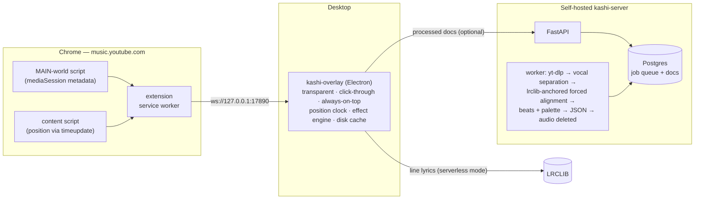

<div align="center">

# Kashi (歌詞)

**Word-level karaoke lyrics for your desktop — themed by the album art, synced to the beat.**

[](https://github.com/csermet/kashi/actions/workflows/ci.yml)
[](LICENSE)
[](apps/overlay)
[](apps/extension)
[](apps/server)

Play music on YouTube Music; Kashi shows the lyrics in a transparent, draggable,
click-through overlay anywhere on your screen. Works out of the box with
line-synced lyrics from [LRCLIB](https://lrclib.net) — add the optional
self-hosted server and songs get **word-by-word karaoke highlighting**,
**album-art color themes** and **beat-synced effects**.

</div>

<!-- screenshots: drop PNGs into docs/media/ and uncomment
## 📸 Screenshots

| Word karaoke + album theme | Sustained-vowel sweep | Tray controls |
|---|---|---|
|  |  |  |
-->

## ✨ Features

- 🎤 **Word-level karaoke** — the active word lifts and lights up in sync with the vocal
- 🎨 **Album-art theming** — colors are extracted server-side, then re-rendered client-side
  through an OKLCH tone-mapping system (*hue is data, tone is design*): never muddy,
  never washed out, always readable
- 🌊 **Sustained-vowel sweeps** — long-held words and "ooh-whoa" ad-lib lines fill
  left-to-right like a classic karaoke bar; runs sweep as one gesture
- 🎙️ **Ad-lib styling** — nonlexical backing-vocal lines render italic and subdued
- 💓 **Beat pulse** — the box breathes with the beat grid (downbeats hit harder),
  as an eased light ring
- ⚡ **Nightcore aware** — sped-up reuploads are auto-detected (duration-ratio
  analysis against the original), aligned on a slowed copy and rescaled back,
  with a CTC-probability gate against wrong-song matches
- 📝 **Zero-setup fallback** — without a server you still get line-synced lyrics
  from LRCLIB, with polite caching and etiquette
- 🖱️ **Stays out of your way** — transparent, click-through, always-on-top;
  drag it anywhere, it remembers its place across monitors and DPI changes
- 🎛️ **Tray-tunable** — effect level (Off/Simple/Full), theme scope, box opacity
  (0–90%), lyric timing offset (presets or exact ms)

## 🏗 How it works



| Component | Path | Stack |
|---|---|---|
| Browser extension | `apps/extension` | Chrome MV3, TypeScript, Vite + CRXJS |
| Desktop overlay | `apps/overlay` | Electron, TypeScript, electron-vite |
| Processing server | `apps/server` | Python 3.12, FastAPI, Postgres |
| Data contracts | `packages/schemas`, `packages/protocol` | JSON Schema (single source of truth) |

## 🚀 Quick start (serverless)

Prereqs: Node.js 22 LTS + pnpm 11 (via corepack).

```bash
git clone https://github.com/csermet/kashi && cd kashi
pnpm install
pnpm --filter kashi-extension build   # then load apps/extension/dist as an
                                      # unpacked extension at chrome://extensions
pnpm --filter kashi-overlay dev       # start the overlay
```

Open [music.youtube.com](https://music.youtube.com), play a song — lyrics appear
within a couple of seconds. Right-click the lyric box (or the tray icon) for
settings.

## 🖥 Self-hosting the server (optional)

The server turns songs into word-timed documents: it downloads the audio once,
separates vocals, force-aligns the LRCLIB text against them, extracts a beat
grid and an album palette, stores a small JSON — and deletes the audio.

```bash
cd deploy && cp .env.example .env    # set ADMIN_API_KEY etc.
docker compose up -d                 # FastAPI + Postgres + worker
```

Then point the overlay at it (`kashi-settings.json`): `server_url` +
`server_api_key`. Kubernetes manifests live in `deploy/k8s/`. Prebuilt images:
[`ghcr.io/csermet/kashi-server`](https://github.com/csermet/kashi/pkgs/container/kashi-server).

### API cookbook

The overlay only ever sends `source` + `hints`; `options` is the manual escape
hatch for tracks the automatic flow gets wrong (mangled upload titles,
nightcore reuploads, lyrics LRCLIB doesn't have):

```bash
curl -X POST "$SERVER/v1/ingest" -H "Authorization: Bearer $KEY" -H 'Content-Type: application/json' -d '{
  "source": {"type": "youtube", "id": "o_j0tc0njUY"},
  "hints": {"title": "Nightcore - Song (Lyrics)", "artist": "SomeChannel"},
  "options": {"original_title": "Song"}
}'
curl "$SERVER/v1/jobs/$JOB_ID" -H "Authorization: Bearer $KEY"   # queued → ... → completed
```

- `original_title` — search LRCLIB for this title instead of the upload's.
- `speed_factor` (e.g. `1.25`) — skip detection: the known sped-up factor.
- `lyrics_text` — align this plain text instead of anything from LRCLIB.

Each option works alone; all of them also work on normal-speed tracks. For a
track that already has a (wrong) document or a failed job, `POST
/v1/admin/reprocess` (admin key) forces a fresh run and takes the same
`options`.

**Bring your own audio** (a track that isn't on YouTube): stage the file
first, then ingest the returned `source` ref like any other track:

```bash
curl -X POST "$SERVER/v1/uploads" -H "Authorization: Bearer $KEY" \
  -F "file=@song.mp3"
# -> {"source": {"type": "upload", "id": "…"}, "duration_ms": 213000, "expires_at": "…"}
curl -X POST "$SERVER/v1/ingest" -H "Authorization: Bearer $KEY" -H 'Content-Type: application/json' -d '{
  "source": {"type": "upload", "id": "PASTE_ID"},
  "hints": {"title": "Song", "artist": "Artist"}
}'
```

Uploads are staging only (64 MB cap, validated with ffprobe): the bytes are
deleted the moment the job finishes — succeed or fail — and unclaimed uploads
expire after 24 h. Re-upload and re-ingest to process the same file again.
The ingest response also carries `reused`: `true` + `status: failed` means
the 7-day permanent-fail block answered, not a fresh attempt.

**Contributing timings back to LRCLIB** (off by default): when a
kashi-server word-sync document is on screen, the tray gains *Report good
sync to LRCLIB*. The server only queues operator-approved requests, applies
a hard quality gate (lrclib-sourced text only, no nightcore clocks, no
QA-repaired or synthetic word spans), solves LRCLIB's proof-of-work
challenge and publishes a Lyricsfile. Two server flags guard it:
`KASHI_LRCLIB_PUBLISH_ENABLED` (endpoint) and `KASHI_LRCLIB_PUBLISH_DRY_RUN`
(logs the exact YAML instead of publishing until you're sure).

## 🧪 Development

```bash
pnpm install && pnpm build           # extension + overlay + contracts
pnpm -r test && pnpm -r typecheck
cd apps/server && uv sync && uv run pytest   # needs Python 3.12 + uv
```

Project-specific review agents live in `.claude/agents/`.

## 🔧 Troubleshooting

- **The translucent box seems to change opacity while you scroll or interact
  (screenshots always look fine):** check your MONITOR's own HDR setting. A
  monitor doing SDR→HDR expansion (monitor HDR on, Windows HDR off) re-tone-maps
  content dynamically and translucent overlays visibly shift with it. Fix: turn
  HDR off on the monitor, or enable HDR in BOTH Windows and the monitor (a real
  HDR signal disables the monitor's dynamic expansion). This happens after the
  GPU framebuffer — no application can prevent it.
- **The box fades when idle for a few seconds (Windows):** fixed in overlay
  0.2.9+ (Chromium's native window-occlusion tracker is disabled for Kashi).
- **`Unable to move the cache` errors on startup:** harmless and gone in 0.2.9+
  (Kashi doesn't use Chromium disk caches). If the WS port drifts to 17891, an
  old Kashi instance is still running — kill it; 0.2.8+ prevents this with a
  single-instance lock.

## 🗺 Roadmap

Phase 6.5: effects beyond the box (ambient category glow, icons entering from
outside the lyric box), richer fx lexicon, real song-structure sections, a
canvas effect-layer experiment.

Later: Chrome Web Store, Plex as a source, macOS support, auto-update.

## 📄 License

[MIT](LICENSE)
